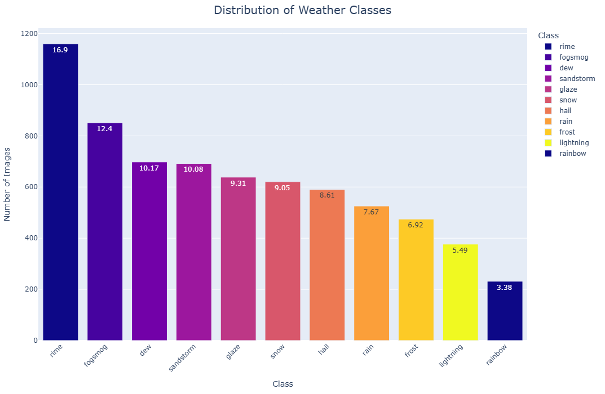
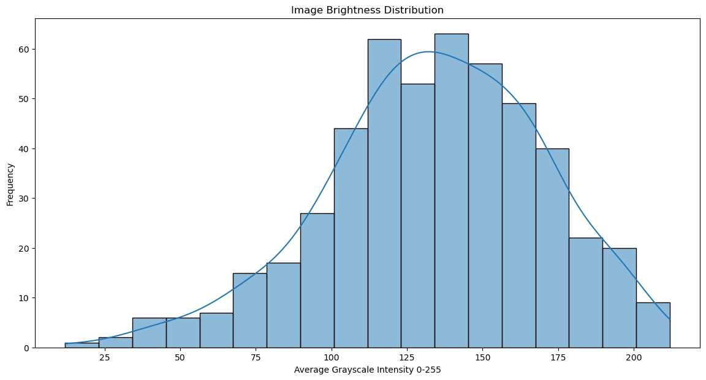
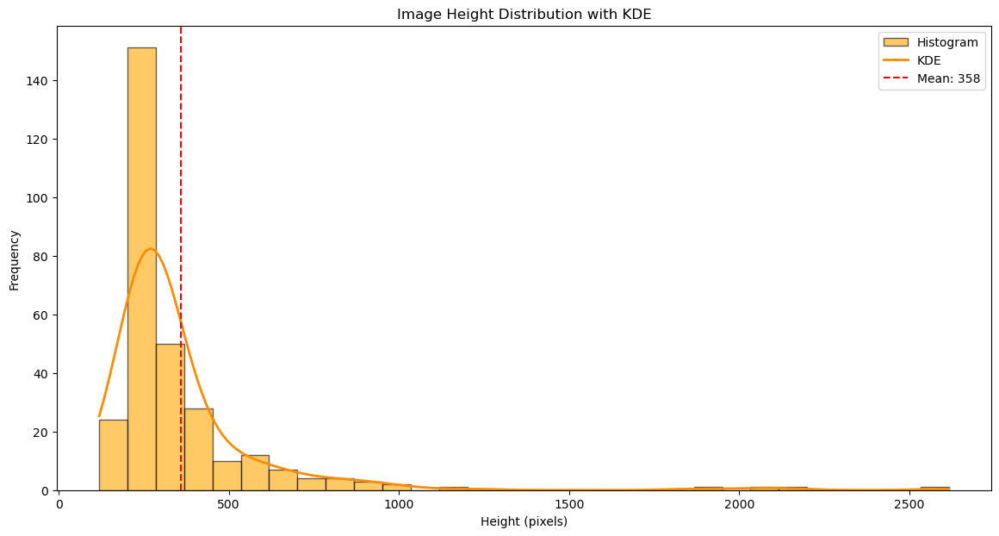
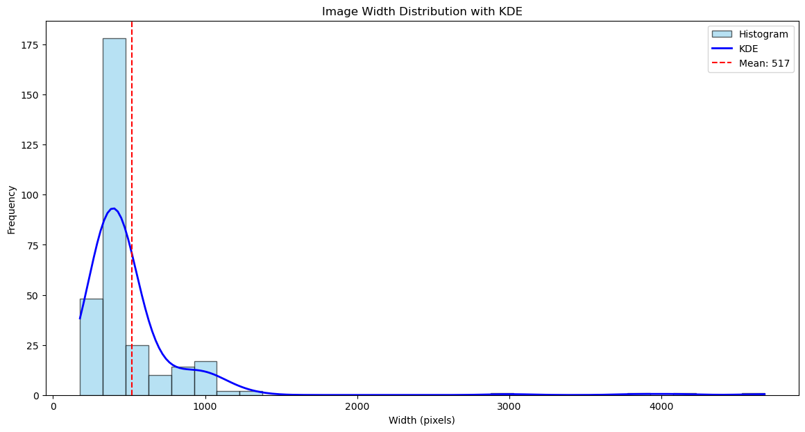
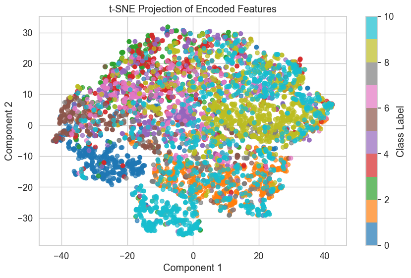
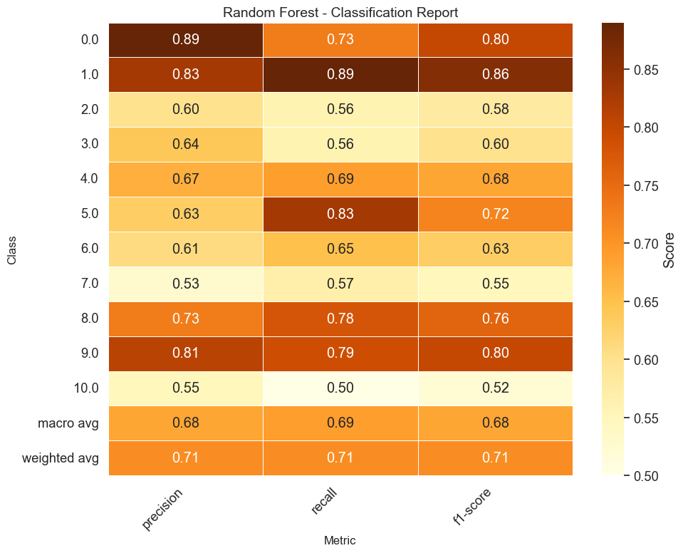
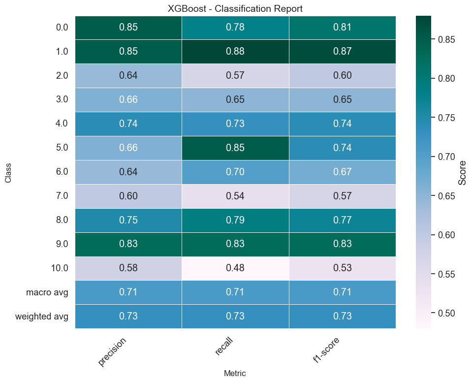
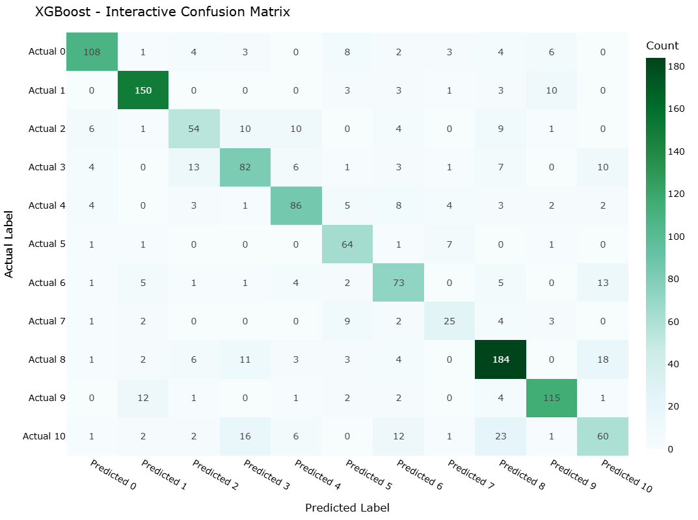

# Weather Image Classification — Autoencoder + Classical ML (Model 2 & 3)

An alternative pipeline for the weather image task that learns **latent features with a convolutional autoencoder (CAE)** and trains **classical classifiers** (Random Forest and XGBoost) on those embeddings. This complements your MobileNetV2 transfer‑learning project with a lighter, interpretable approach.

## Project Overview
- **Goal**: Predict the weather category from an input image.
- **Approach**: Train a CAE → extract latent vectors → (optional) PCA/t‑SNE for visualization → train **Random Forest** and **XGBoost** on the embeddings → evaluate with classification report and confusion matrix.
- **Why**: Lower compute cost, faster iteration, and easier model interpretation than end‑to‑end deep CNNs.

## Dataset
**Source:** [Weather Dataset (Kaggle) — Jehan Bhathena](https://www.kaggle.com/datasets/jehanbhathena/weather-dataset)  
Images are organized by class in folders. Raw data is **not** tracked in git—keep it locally under `data/` (see `.gitignore`).

A common local layout:
```
data/
├── class_1/  *.jpg|png
├── class_2/  *.jpg|png
└── ...
```

## Results (Representative)
- **Random Forest**: Accuracy ≈ 0.71 (macro‑F1 ≈ 0.69)
- **XGBoost**: Accuracy ≈ 0.73 (macro‑F1 ≈ 0.71)

> Exact numbers depend on your split and random seeds; see the notebook for the final printed metrics.

## Figures

### Exploratory Data Analysis






### Autoencoder Embeddings


### Random Forest



### XGBoost


<!-- If you renamed "ROC comparison" to roc_comparison.png, uncomment the line below -->
<!--  -->

> Note: If your file is named with a space (e.g., `ROC comparison.png`), consider renaming to `roc_comparison.png` so Markdown links work reliably.

## How to Run

### 1) Environment
```bash
python -m venv .venv
# macOS/Linux
source .venv/bin/activate
# Windows
# .venv\Scripts\activate

pip install -r requirements.txt
```

### 2) Data
Download from Kaggle and place images under `data/` (class‑labeled subfolders).

### 3) Notebook
```bash
jupyter notebook notebooks/Group_Project.ipynb
```
Run all cells to: train the autoencoder → extract embeddings → train RF/XGBoost → export evaluation figures into `images/`.

## Repository Structure
```
.
├── data/
│   └── .gitkeep
├── images/
│   ├── classes_distribution.png
│   ├── brightness_distribution.png
│   ├── image_height_distribution.png
│   ├── image_width_distribution.png
│   ├── visual_inspection.png
│   ├── tsne_projection.png
│   ├── classification_report_rf.png
│   ├── confusion_matrix_rf.png
│   ├── classification_report_xgb.png
│   └── confusion_matrix_xgb.png
├── notebooks/
│   └── weather_image_classification_autoencoder.ipynb
├── .gitignore
├── LICENSE
├── README.md
└── requirements.txt
```

## Requirements
- TensorFlow/Keras (autoencoder)
- scikit‑learn (RandomForest, metrics, PCA/t‑SNE)
- xgboost
- numpy, pandas, matplotlib, seaborn, Pillow

Install with `pip install -r requirements.txt`.

## Author
Kajal Singh — Post‑Degree Diploma in Data Analytics, Douglas College  
License: MIT
