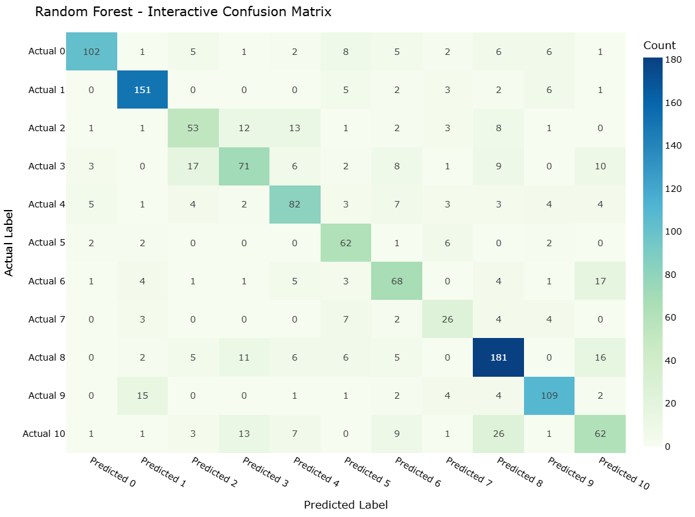

# Weather Image Classification — Autoencoder + Classical ML (Model 2 & 3)
Alternative pipeline that learns **latent features with a convolutional autoencoder (CAE)** and trains **classical classifiers** (Random Forest, XGBoost) on those embeddings. Complements the MobileNetV2 project with a lower‑capacity, interpretable approach.
## Project Overview
- **Goal**: Predict the weather category from an input image.
- **Approach**: Train a CAE → extract latent vectors → optional PCA → train Random Forest / XGBoost → evaluate with confusion matrix and classification report.
- **Models in notebook**: Convolutional Autoencoder, Random Forest, XGBoost
- **Reported metrics**: Accuracy ≈ 4.200 | Macro‑F1 ≈ 0.810
## Dataset
**Source:** [Weather Dataset (Kaggle) — Jehan Bhathena](https://www.kaggle.com/datasets/jehanbhathena/weather-dataset)
- Images are organized by class; raw data is kept locally under `data/` and not committed.
## Figures





## How to Run
```bash
python -m venv .venv
# macOS/Linux
source .venv/bin/activate
# Windows
# .venv\\Scripts\\activate
pip install -r requirements.txt
jupyter notebook notebooks/Group_Project.ipynb
```
## Repository Structure
```
.
├── data/
│   └── .gitkeep
├── images/
├── notebooks/
│   └── Group_Project.ipynb
├── .gitignore
├── LICENSE
├── README.md
└── requirements.txt
```

## Requirements
TensorFlow/Keras, scikit-learn, xgboost, numpy, pandas, matplotlib, seaborn.

## Author
Kajal Singh — Post‑Degree Diploma in Data Analytics, Douglas College
